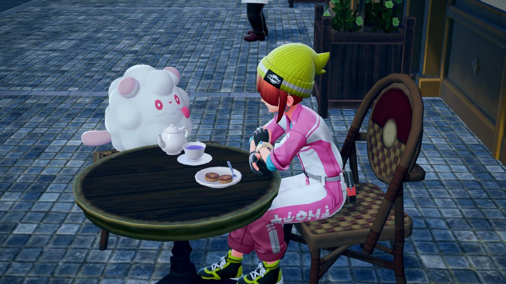

Hello! I’m Yage ([/jakɤ/](), or "yah-kuh" where the "k" is unaspirated) and I'm an incoming PhD student in Language Science at UC Irvine, starting Fall 2026. I recently graduated from UC San Diego double majoring in Linguistics and Cognitive Science (with a minor in Music). 

I want to believe that we can't fully understand language and cognition unless we understand the language and minds in different groups across various situations, and to some extent that's what motivates my research. Broadly speaking, my [research interest](/research/) centers around the cognitive devices involved in pragmatics and semantics. I am particularly interested in the role of theory of mind, and it's development and breakdown, in language. I first became interested in this area thinking about communication in autism (and how theory of mind/egocentricity is/isn't involved), and now I like to approach this big topic using various methods from different aspects. I am also interested in the internal experience one has and its interaction with language, such as bilingualism, musical pitch perception, and aphantasia. 

Outside of academics, I am passionate about music and [art](https://www.instagram.com/mobigreus/), as well as reading and writing. There are a bunch of topics that I particularly care about, including disability rights, theology & philosophy, and anthropology. 

{: width="270" height="130" }